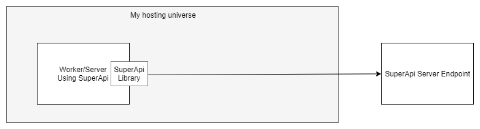
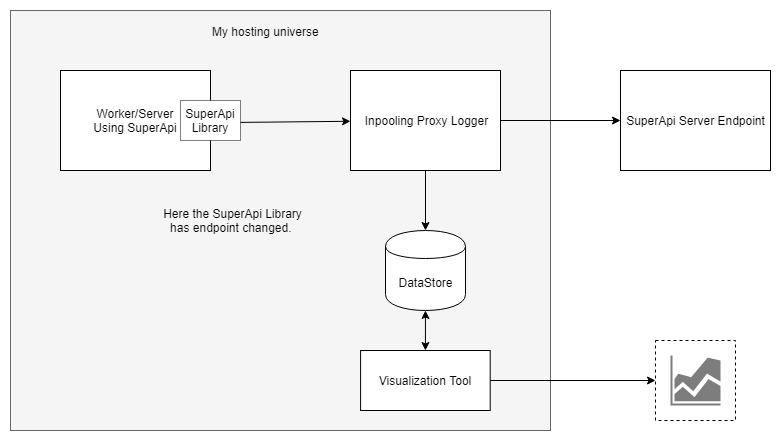
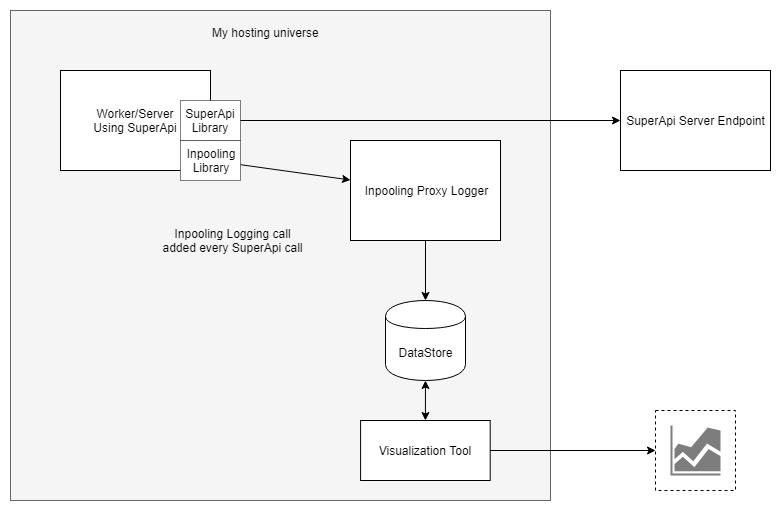
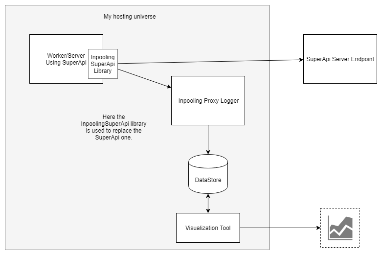

# Default state

We are using an client API (aka 3rd party API) named SuperApi and calling it directly through the provided library. It's the default state with no 
logging options.


# Inpooling API Logging

To log client API calls as well as metadata, there are multiple options. We provide options so users can choose based on their needs.

## Endpoint Redirection (API Proxy)

The first way to capture API meta data is to change the endpoint configured in the library.
A new endpoint in a format :
```python
logging_endpoint="https://inpooling-logging/api/"
superapi_host="https://superapi.example"
superapi_host_encoded=urlencode(superapi_host)

new_url=logging_endpoint + urlencode(superapi_host)

# https://inpooling-logging/api/https%3A%2F%2Fsuperapi.example
```




One of the main downsides of this option is having more hops.
We can have logging server on the same network as the rest of the infrastructure to lower latency.

The main advantage of this system is the possibility to use advanced
feature of the logging server (credentials management, circuit breaker, ...). 

Also, this option provides API integration development. The most suitable use case will be for less time-sensitive APIs, or New APIs. 

## Manual Logging

One other way is to add manual logging statements every time the SuperApi is called.
The Inpooling Logging library will call the logging server in the background without slowing the main process.

```python
SuperApi().request(data=data)
InpoolingLogging().log(data=data)
```





Inpooling Library can monkey patch or integrate with well known high level library.
For example the requests library in python.
```python
from superapi import SuperApi
InpoolingLogging.log_request_patch() # To call once after importing requests

SuperApi().request(data=data) # Use requests in the background
```

## Library Replacing

Some open source library are forked and modified to add the inpooling logging.
The behavior is strictly the same, but the Logging system knows deeply what can 
be sent and log in a deeper way than just logging.

```python
InpoolingLoggingSuperApi().log(data=data)
```





# Questions

## How do I know if I don't miss calls ?

Inpooling provide several code parser that will point to places libraries are used in the code base.
We recommend using the feature of your hosting provider to log egress network packets 

## Why not just using Egress logging ?

Most of the query for external api are in https (as they should).
Egress logging will provide some information, but won't be able to access the content of the api calls.

Egress logging don't allow some more advanced features that modify the request as they are passive.


## What if I kill servers randomly ?

You got us, the CAP theorem make it impossible to have the best of everything.
Because the logging is mostly used on high volumes of data,
losing some of it should not be a big problem.

So every choice made is made to improve speed first, as to lower the impact on the production servers.
That's why the Inpooling manual logging default behavior is to spawn a background thread as to send the data.
It is possible to override the default settings if necessary.


